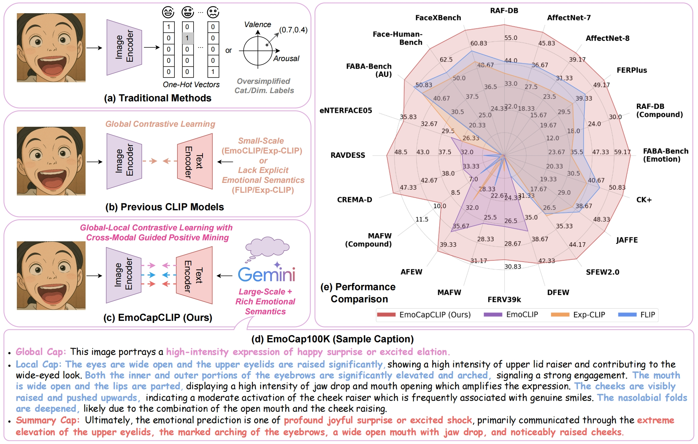

# EmoCapCLIP
EmoCapCLIP: Learning Transferable Facial Emotion Representations from Large-Scale Semantically Rich Captions

## ✨ Overview

    
  Overview of EmoCapCLIP

Abstract: Current facial emotion recognition systems are predominately trained to predict a fixed set of predefined categories or abstract dimensional values. This constrained form of supervision hinders generalization and applicability, as it reduces the rich and nuanced spectrum of emotions into oversimplified labels or scales. In contrast, natural language provides a more flexible, expressive, and interpretable way to represent emotions, offering a much broader source of supervision. Yet, leveraging semantically rich natural language captions as supervisory signals for facial emotion representation learning remains relatively underexplored, primarily due to two key challenges: 1) the lack of large-scale caption datasets with rich emotional semantics, and 2) the absence of effective frameworks tailored to harness such rich supervision. To this end, we introduce EmoCap100K, a large-scale facial emotion caption dataset comprising over 100,000 samples, featuring rich and structured semantic descriptions that capture both global affective states and fine-grained local facial behaviors. Building upon this dataset, we further propose EmoCapCLIP, which incorporates a joint global-local contrastive learning framework enhanced by a cross-modal guided positive mining module. This design facilitates the comprehensive exploitation of multi-level caption information while accommodating semantic similarities between closely related expressions. Extensive evaluations on over 20 benchmarks covering five tasks demonstrate the superior performance of our method, highlighting the promise of learning facial emotion representations from large-scale semantically rich captions.
